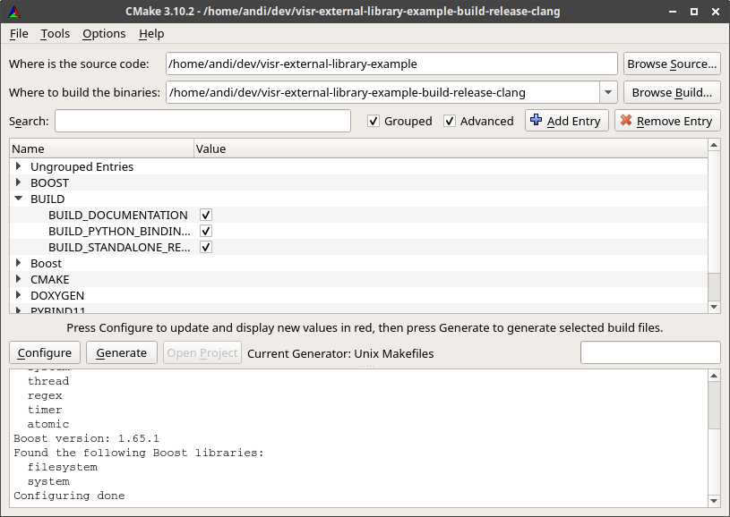

.. Copyright Andreas Franck 2018 <a.franck@soton.ac.uk> --- All rights reserved.
   Copyright Institute of Sound and Vibration Research,
   University of Southampton --- All rights reserved.

Building the code
=================

In contrast to interpreted languages as Python, C++ source code must be built, ompiled, into a binary form before it can be used.

This section describes the process of compiling the project in details.

Prerequisites
-------------

As the VISR framework itself, the code C++ extension tutorial is portable.
The following platforms are supported:

* Windows 64 Bit, for example Windows 10
* Mac OS X Versions >= 10.9, 64 Bit
* Linux 32 and 64 Bit. Binary packages are provided for Ubuntu 16 and Ubuntu 18 (x86_64 architecture) and Raspbian Stretch (Raspberry Pi, 32 Bit)

On the computer, the following software tools are required:

VISR framework
  We suggest a binary installation package. Obtaining and installing is described in the `Installation <http://cvssp.org/data/s3a/public/VISR-API/userdoc/html/installation.html>`_ section of the `VISR user documentation <http://cvssp.org/data/s3a/public/VISR-API/userdoc/html/index.html>`_. When using the component-enabled installers on Windows or Mac OS X, please select the component "Development files". In addition we suggest to install the "Python externals" options, because it enables testing and integration the components built in this tutorial in an interactive Python environment.
git version control client
  For obtaining the source code and versioning of source code changes.
A C++11-compliant compiler or development environment
  The tutorial has been test with Visual Studio 2018 on Windows, XCode on Mac OS X, and with the g++ and clang++ compilers on Linux.
CMake
 This portable build tool can be obtained from www.cmake.org or through the operatiing system's software package management (e.g, homebrew or MacPorts on Mac OS, apt or yum on Windows).
Python 3 distribution:
  Although the tutorial components can also used without Python, the full potential of C++ extensions is utilized when they are used interactively and in combination with Python components.

Getting the tutorial code
-------------------------

The tutorial can be obtained from the git repository https://gitlab.eps.surrey.ac.uk/s3a/visr-external-library-example .
With a command-line git client, the code is cloned (downloaded) with the command 
.. code-block:: bash

   cd <some directory>
   git clone https://gitlab.eps.surrey.ac.uk/s3a/visr-external-library-example

After that, the source code resides in a directory :code:`visr-external-library-example` within :code:`<some directory>`.
Throughout this tutorial, we use `$SRC` to denote the directory :code:`<some directory>/visr-external-library-example`.

Preparing the build environment
-------------------------------

As explained above, this tutorial uses CMake to build the code into binary. 
In addition to the features and the widespread use of this build tool, this decision is also based the fact that the VISR framework makes its development interfaces available through a CMake mechanism called *exported targets*, e.g., https://gitlab.kitware.com/cmake/community/wikis/doc/tutorials/Exporting-and-Importing-Targets .
Using this facility eases creating software that builds upon the VISR and avoids many potential errors.
CMake can be used both as a command line tool and with a graphical user interface (GUI).
This tutorial describes the use of the GUI, howver, it is easy to adapt to command line Cmake commands.
The CMake GUI is depiced in Figure :code:`figure_visr_cxx_tutrial_building_cmake_gui`

.. _figure_visr_cxx_tutorial_building_cmake_gui:

   
   CMake graphical user interface.

